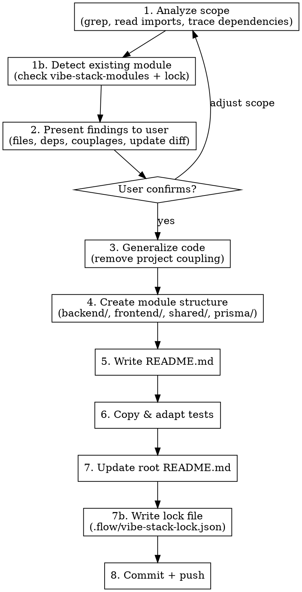

# Export Module

Extract a feature from the current vibe-stack project into a reusable module in `~/Dev/vibe-stack-modules/`.

**Reference:** Always read `~/Dev/vibe-stack-modules/CONTRIBUTING.md` at the start — it's the source of truth for module structure and conventions.

## Process



## Step 1 — Analyze Scope

Given `<name>`, search the current project for all related files:

1. **Backend**: `apps/api/src/modules/<name>/` — services, trpc, module, tests
2. **Frontend**: grep for components, pages, hooks referencing the module
3. **Shared**: `packages/shared/src/schemas/` — related Zod schemas
4. **Stores**: `apps/web/src/stores/` — related Zustand stores
5. **Prisma**: grep `prisma/schema.prisma` for related models
6. **Dependencies**: trace npm imports unique to this module

If `<name>` is ambiguous (no clear module folder, multiple candidates), use AskUserQuestion to clarify scope.

If the user provided extra context after the module name, use it to narrow the scope.

## Step 1b — Detect Existing Module

Check if `~/Dev/vibe-stack-modules/modules/<name>/` already exists.

**If the module does NOT exist** -> skip to Step 2 (classic export flow).

**If the module already exists** -> enter **update mode**:

1. **Read lock file**: check `.flow/vibe-stack-lock.json` in the current project for an entry matching `<name>`.
   - The lock stores `commit` (the vibe-stack-modules commit hash at last export) and `files` (mapping of source paths to module paths).
   - If no lock entry exists, warn the user that there is no baseline commit and ask whether to proceed with a full overwrite or abort.

2. **Compute local improvements** (changes made in the project to push upstream):
   ```bash
   # For each file in the lock mapping, diff the locked version vs current project file
   cd ~/Dev/vibe-stack-modules && git show <locked-commit>:modules/<name>/<path> > /tmp/locked_version
   diff /tmp/locked_version <current-project-file>
   ```

3. **Compute upstream changes** (changes in vibe-stack-modules since the lock):
   ```bash
   cd ~/Dev/vibe-stack-modules && git diff <locked-commit>..HEAD -- modules/<name>/
   ```

4. **Present both diffs** to the user:
   ```
   Module "<name>" already exists in vibe-stack-modules.
   Mode: UPDATE (locked at <short-commit>)

   Local improvements to push upstream:
     - backend/service.ts: +15 -3 (added caching logic)
     - shared/schema.ts: +5 -0 (new field)

   Upstream changes since last export (will be preserved):
     - README.md: +10 -2 (documentation improvements)
     - backend/service.ts: +2 -1 (typo fix)

   Conflicts (same file changed both sides):
     - backend/service.ts -> will need manual review

   Proceed with update?
   ```

5. Wait for user confirmation. On "yes", apply local improvements into vibe-stack-modules while preserving upstream changes. For conflicting files, apply both sets of changes carefully (prefer local improvements when intent is clear, flag ambiguous conflicts to the user).

## Step 2 — Present Findings

Show the user a summary before proceeding:

```
Module: <name>
Type: Backend-only | Frontend-only | Full-stack

Files to export:
  backend/
    - service.ts (from apps/api/src/modules/<name>/)
    - ...
  frontend/
    - Component.tsx (from apps/web/src/components/<name>/)
    - ...
  shared/
    - schema.ts (from packages/shared/src/schemas/)
  prisma/
    - schema.prisma (models: ModelA, ModelB)
  tests/
    - service.spec.ts

Dependencies: zod, ioredis, ...
Couplages to generalize:
  - Import of ProjectSpecificService -> will abstract
  - Hardcoded enum -> will use string type
  - French labels -> will translate to English

Proceed?
```

Wait for user confirmation before continuing.

## Step 3 — Generalize Code

Apply these patterns (from CONTRIBUTING.md):

| Coupling | Generic Pattern |
|----------|----------------|
| Hardcoded enum (`type X = 'a' \| 'b'`) | `type X = string` or generic param |
| Switch/case with project imports | Registry pattern: consumer registers handlers |
| Direct import of project component | Render prop or slot via props |
| Project-specific store (sidebar, auth) | Remove — consumer integrates |
| Bidirectional type mapping | Remove — project-specific |
| URL sync, routing | Remove or make optional |
| i18n (French text) | English by default |
| PrismaService import path | Use relative `../prisma/prisma.service` placeholder |

**Rule:** If an import points outside the module, it's coupling to treat.

**Allowed external imports:**
- npm packages (`zustand`, `@dnd-kit/core`, etc.)
- Generic framework utils (`@/lib/utils` for `cn()`)
- Base UI components (`@/components/ui/*` for shadcn)

## Step 4 — Create Module Structure

Target: `~/Dev/vibe-stack-modules/modules/<name>/`

```
modules/<name>/
├── README.md
├── backend/          # If applicable
│   ├── <service>.ts
│   ├── <service>.module.ts
│   └── <service>.spec.ts
├── frontend/         # If applicable (components)
│   └── ...
├── hooks/            # If applicable (React hooks)
│   └── ...
├── store/            # If applicable (Zustand stores)
│   └── ...
├── shared/           # If applicable (Zod schemas, types)
│   └── ...
└── prisma/           # If applicable (Prisma models)
    └── schema.prisma # Only the relevant models, not the full schema
```

**Do NOT include empty directories.**

### Prisma convention

If the module uses Prisma models, create `prisma/schema.prisma` containing ONLY the relevant models (no datasource/generator blocks). Example:

```prisma
// Models required by this module
// Copy these into your project's prisma/schema.prisma

model MagicLink {
  id        String    @id @default(cuid())
  email     String
  tokenHash String    @unique
  expiresAt DateTime
  usedAt    DateTime?
  createdAt DateTime  @default(now())

  @@index([email, createdAt])
  @@map("magic_links")
}
```

## Step 5 — Write README.md

Follow this structure (see existing modules for examples):

1. **Title + description** (2-3 lines)
2. **Files** — tree of the module
3. **Dependencies** — npm packages + infrastructure (Redis, PostgreSQL, etc.)
4. **Integration** — numbered steps:
   - Copy files (where to put them)
   - Add Prisma models (if applicable) + run migration
   - Adapt imports
   - Install npm deps
   - Add env variables (if applicable)
   - Register NestJS module (if applicable)
   - Wire into existing services
   - Add tRPC procedures (if applicable)
   - Frontend usage examples
5. **API** — interfaces and main functions (tables)
6. **Differences from source project** — table of what changed during generalization

## Step 6 — Tests

- **Export existing tests** that are self-contained (no heavy project fixtures)
- Adapt imports to module-relative paths
- **Do NOT create new tests** — only export what exists
- If no tests exist, mention it in the summary

## Step 7 — Update Root README

Add the new module to the table in `~/Dev/vibe-stack-modules/README.md`:

```markdown
| [<name>](modules/<name>/) | <description> | <type: Backend/Frontend/Full-stack> |
```

## Step 7b — Write Lock File

After all module files are written to vibe-stack-modules (Steps 4-7), update the lock file in the **source project**.

1. **Read or create** `.flow/vibe-stack-lock.json` in the current project root.

2. The lock file structure:
   ```json
   {
     "modules": {
       "<name>": {
         "commit": "<vibe-stack-modules commit hash>",
         "date": "YYYY-MM-DD",
         "files": {
           "apps/api/src/modules/<name>/service.ts": "backend/service.ts",
           "apps/web/src/components/<name>/Component.tsx": "frontend/Component.tsx"
         }
       }
     }
   }
   ```
   - `commit`: the vibe-stack-modules commit hash (retrieved after Step 8 commit)
   - `date`: the commit date
   - `files`: mapping of project source paths to module-relative paths

3. **Important**: the commit hash is only available after the vibe-stack-modules commit in Step 8. The lock write is therefore split:
   - **Before Step 8**: prepare the file mapping in memory
   - **After Step 8 commit**: retrieve the commit hash and date, then write/update the lock file:
     ```bash
     cd ~/Dev/vibe-stack-modules && git log -1 --format="%H" -- modules/<name>/
     cd ~/Dev/vibe-stack-modules && git log -1 --format="%Y-%m-%d" -- modules/<name>/
     ```
   - Write the updated `.flow/vibe-stack-lock.json` in the source project
   - Commit the lock file in the source project:
     ```bash
     git add .flow/vibe-stack-lock.json
     git commit -m "chore: update vibe-stack lock for <name> module"
     ```

## Step 8 — Commit + Push

```bash
cd ~/Dev/vibe-stack-modules
git add modules/<name>/ README.md
git commit -m "feat(modules): add <name> module"    # or "update" for existing modules
git push
```

**No confirmation needed** — exporting a module is the explicit intent.

After the commit, complete Step 7b by writing the lock file with the new commit hash.

For **update mode**, use the commit message: `feat(modules): update <name> module`

## Summary

At the end of the export, present:

```
Export complete:
  - Module: <name> (new | updated)
  - Location: ~/Dev/vibe-stack-modules/modules/<name>/
  - Commit: <short-hash> in vibe-stack-modules
  - Lock: .flow/vibe-stack-lock.json updated (commit <short-hash>)
  - Files exported: N files
  - Tests: N tests exported | no tests
```

## Edge Cases

- **Module already exists** in vibe-stack-modules: handled by Step 1b (update mode with diff analysis)
- **Heavy project coupling** that can't be easily abstracted: flag in summary, suggest splitting
- **Multiple Prisma models with relations**: include all related models in prisma/schema.prisma, document required relations in README
- **No lock entry for existing module**: warn user, offer full overwrite or abort
- **Conflicting changes** (same file modified locally and upstream): present conflicts explicitly, ask user for resolution strategy
