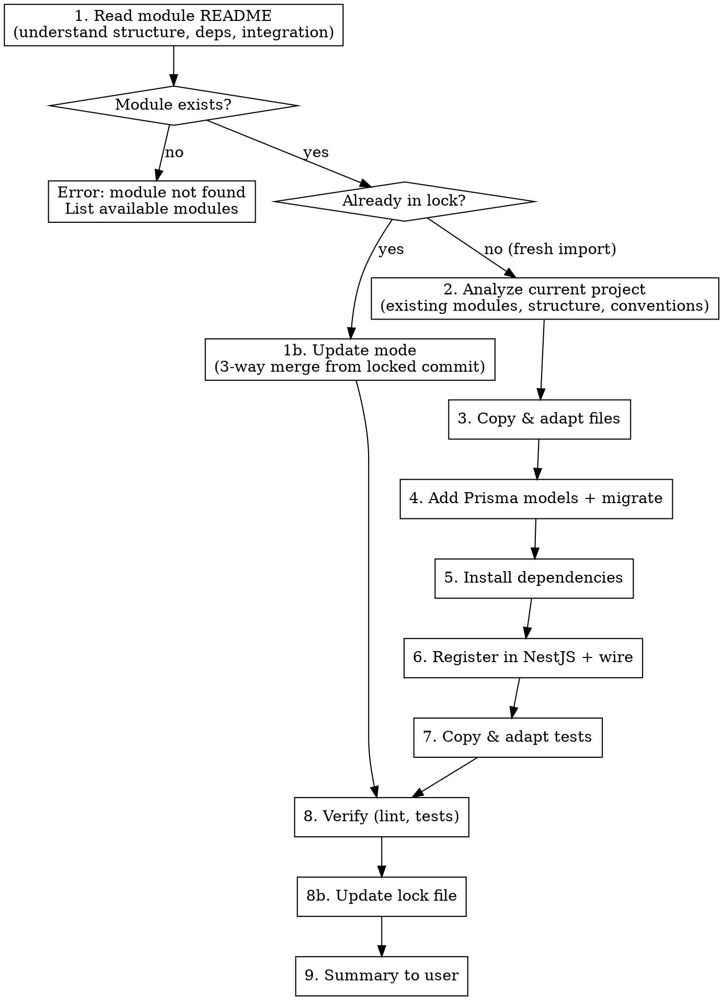

# Import Module

Import a module from `~/Dev/vibe-stack-modules/` into the current vibe-stack project, fully integrated and functional.

## Process



## Step 1 — Read Module

Read the README of `~/Dev/vibe-stack-modules/modules/<arg1>/README.md`.

If the module does not exist, list available modules and stop:
```
Module "<arg1>" not found. Available modules:
- magic-link: Passwordless auth via magic link
- editor-tabs: VS Code-like tabs with DnD
- ...
```

## Step 1b — Check Lock & Detect Update

After confirming the module exists, check if it was already imported:

1. Read `.flow/vibe-stack-lock.json` at the project root (if it exists)
2. If the module is **NOT** in the lock → continue to Step 2 (fresh import)
3. If the module **IS** in the lock → **update mode**:

### Update Mode

a. Retrieve the locked commit hash from `modules.<name>.commit`
b. Get the current HEAD commit of the module:
   ```bash
   cd ~/Dev/vibe-stack-modules && git log -1 --format="%H" -- modules/<name>/
   ```
c. If the locked commit equals HEAD → inform the user the module is already up to date, stop
d. Show the diff between locked commit and HEAD:
   ```bash
   cd ~/Dev/vibe-stack-modules && git diff <locked-commit> HEAD -- modules/<name>/
   ```
e. Show the changes to the user and ask for confirmation to proceed
f. For each file in the lock's `files` mapping, perform a **3-way merge**:
   - **Base**: file content at the locked commit (`git show <locked-commit>:modules/<name>/<source-path>`)
   - **Theirs**: file content at HEAD in `~/Dev/vibe-stack-modules/modules/<name>/<source-path>`
   - **Ours**: current file in the project (at the destination path from the lock mapping)
   - Apply the merge, adapting imports as in Step 3
   - If conflicts arise, mark them with conflict markers and warn the user
g. Handle new files in the module (present at HEAD but not in the lock mapping) → import them as fresh files following Step 3 rules
h. Handle deleted files (present in lock mapping but removed at HEAD) → warn the user, do NOT auto-delete
i. After merging, jump to Step 8 (Verify), then Step 8b (Update Lock), then Step 9 (Summary)

## Step 2 — Analyze Current Project

Before copying, understand the target project:

1. **Project structure**: read CLAUDE.md if available, check `apps/api/src/modules/`, `apps/web/src/`
2. **Existing conventions**: import style, path aliases, naming
3. **Prisma schema**: check existing models to avoid conflicts
4. **Existing dependencies**: check `package.json` to avoid duplicates
5. **Port/env config**: check `.env.example` for existing variables

## Step 3 — Copy & Adapt Files

Copy module files to the correct locations in the project:

| Module folder | Project destination |
|---------------|-------------------|
| `backend/` | `apps/api/src/modules/<name>/` |
| `frontend/` | `apps/web/src/components/<name>/` (or appropriate location) |
| `hooks/` | `apps/web/src/hooks/` or colocated with components |
| `store/` | `apps/web/src/stores/` |
| `shared/` | `packages/shared/src/schemas/` |
| Tests (`*.spec.ts`) | Same directory as the file they test |

**Track all file mappings** (source → destination) for the lock file in Step 8b.

**Adapt imports in every copied file:**
- `../prisma/prisma.service` -> actual PrismaService path in project
- `../shared/types` -> `@your-project/shared` or actual shared path
- `@/components/ui/*` -> verify shadcn components exist, install missing ones
- `@/lib/utils` -> verify `cn()` exists

**Follow project conventions:**
- Match existing import style (relative vs aliases)
- Match naming conventions (kebab-case files, PascalCase components)
- Add `@Inject()` on constructor params if project uses explicit DI

## Step 4 — Prisma Models

If the module has `prisma/schema.prisma`:

1. Read the module's prisma file
2. Check for conflicts with existing models in project's `prisma/schema.prisma`
3. Add the models to the project's schema (at the end, with a comment header)
4. Add any necessary relations to existing models
5. Run migration:
   ```bash
   cd apps/api && bunx prisma migrate dev --name add_<module_name>
   ```

If no `prisma/` folder exists but README mentions Prisma models, follow the README instructions.

## Step 5 — Install Dependencies

From the module README, identify required packages:

```bash
cd apps/api && bun add <backend-deps>
cd apps/web && bun add <frontend-deps>
```

**Skip packages already installed** (check package.json first).

For shadcn/ui components, use:
```bash
cd apps/web && bunx shadcn@latest add <component-name>
```

## Step 6 — Register & Wire

### Backend (NestJS)

1. **Register the module** in `apps/api/src/app.module.ts`:
   ```typescript
   import { XxxModule } from './modules/xxx/xxx.module'
   ```

2. **Add tRPC routes** if the module has a `.trpc.ts` file — register in the tRPC router

3. **Wire into existing services** if needed (follow README integration guide)

### Frontend

1. **Add routes** if the module has pages (in the router config)
2. **Add navigation** entries if applicable (sidebar, menu)
3. **Export shared schemas** from the shared package index

## Step 7 — Tests

1. Copy test files from the module to the correct location
2. Adapt imports to project paths
3. Run tests to verify:
   ```bash
   cd apps/api && bun run test -- --filter <module-name>
   ```

If tests reference module-internal paths, update to project paths.

## Step 8 — Verify

Run project verification:
```bash
make lint
```

Fix any lint errors introduced by the import.

## Step 8b — Update Lock File

After a successful import or update, persist the module state in `.flow/vibe-stack-lock.json`:

1. Read the existing lock file, or start with `{ "modules": {} }` if it doesn't exist
2. Get the module's current commit and date:
   ```bash
   cd ~/Dev/vibe-stack-modules && git log -1 --format="%H" -- modules/<name>/
   cd ~/Dev/vibe-stack-modules && git log -1 --format="%Y-%m-%d" -- modules/<name>/
   ```
3. Build the `files` mapping from all files copied/merged (source path relative to `modules/<name>/` → destination path relative to project root)
4. Write/update the entry in the lock:
   ```json
   {
     "modules": {
       "<name>": {
         "commit": "<hash>",
         "date": "<date>",
         "files": {
           "backend/service.ts": "apps/api/src/modules/<name>/service.ts",
           "shared/schema.ts": "packages/shared/src/schemas/<name>.ts"
         }
       }
     }
   }
   ```
5. Write the lock file with 2-space indentation
6. Ensure `.flow/` directory exists before writing

## Step 9 — Summary

Present to the user:

```
Module <name> imported successfully.

Files added:
  - apps/api/src/modules/<name>/ (3 files)
  - packages/shared/src/schemas/<name>.ts
  - ...

Prisma migration: applied (add_<name>)
Dependencies installed: ioredis, nodemailer
NestJS module: registered in app.module.ts

Lock file updated: .flow/vibe-stack-lock.json
Module commit: <hash> (<date>)

Tests: 3 tests passing

Remaining manual steps (if any):
  - Add MAGIC_LINK_EXPIRY_MINUTES to .env
  - Wire into your auth service (see module README step 7)
```

**Do NOT commit** — the user decides when to commit imported changes.

## Edge Cases

- **Module partially imported** (some files already exist): warn, ask user if overwrite
- **Prisma model conflict** (model name already exists): stop, show conflict, ask user
- **Missing shadcn components**: install them automatically
- **Module has no backend/frontend**: only import what exists
- **Project doesn't follow standard structure**: adapt paths based on actual project layout
- **Lock file exists but module entry is corrupted/incomplete**: treat as fresh import, warn user
- **Merge conflicts during update**: keep conflict markers in files, list them in summary
